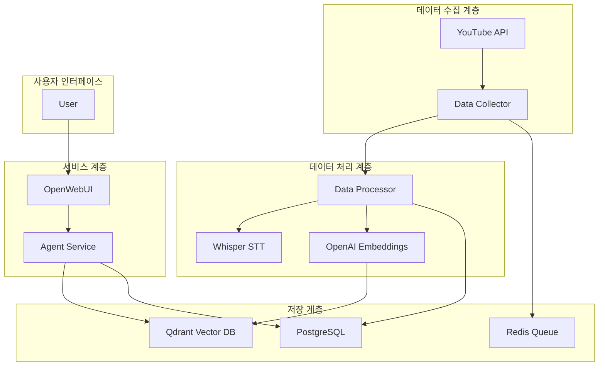

# YouTube Content Agent 🎬

YouTube 채널 콘텐츠를 자동으로 수집하고, RAG(Retrieval-Augmented Generation) 기반 AI 에이전트를 통해 질의응답 서비스를 제공하는 지능형 콘텐츠 분석 플랫폼입니다.

## ✨ 주요 기능

- **자동 콘텐츠 수집**: YouTube 채널의 모든 동영상을 자동으로 수집 및 업데이트
- **고품질 음성 인식**: Whisper Large 모델을 활용한 정확한 한국어 STT 처리
- **다층 지식 구조**: 요약, 전문, 문단, 청크 단위의 다층 벡터 검색
- **지능형 텍스트 청킹**: 문장 기반 의미 단위 분할로 맥락 보존
- **타임스탬프 연동**: 답변과 함께 원본 YouTube 영상의 정확한 시점으로 이동 가능한 링크 제공
- **RAG 기반 응답**: LangGraph를 활용한 다단계 검색-생성-개선 워크플로우
- **통합 임베딩**: BGE-M3 모델 (1024차원) 기반 일관된 벡터 처리
- **통합 관리 대시보드**: 웹 UI를 통한 채널 관리, 모니터링, API 테스트
- **Swagger UI 지원**: 대화형 API 문서 및 테스트 환경 제공
- **OpenWebUI 통합**: 사용자 친화적인 채팅 인터페이스 제공

## 🚀 빠른 시작

### 전제 조건
- Docker 및 Docker Compose
- OpenAI API Key
- 최소 16GB RAM (Whisper Large 모델 실행용)
- 권장: NVIDIA GPU (CUDA 지원)

### GPU 서버 구성
시스템은 GPU 가속을 위한 전용 서버를 제공합니다:

#### Whisper STT 서버
- **모델**: Whisper Large-v3 (GPU 가속)
- **포트**: 8082
- **헬스체크**: `curl http://localhost:8082/health`
- **폴백**: GPU 실패 시 OpenAI Whisper API 자동 사용

#### Embedding 서버
- **모델**: BGE-M3 (1024차원, GPU 가속)
- **포트**: 8083
- **헬스체크**: `curl http://localhost:8083/health`
- **폴백**: GPU 실패 시 OpenAI Embeddings API 자동 사용

### 1단계: 환경 설정

```bash
# 저장소 복제
git clone <repository-url>
cd youtube_agent

# 환경 변수 설정
cp .env.example .env

# .env 파일 편집 (OpenAI API Key 설정 필수)
nano .env
```

### 2단계: 서비스 시작

```bash
# Docker 이미지 빌드 및 서비스 시작
make build
make up

# 또는 docker-compose 직접 사용
docker-compose up -d

# 서비스 상태 확인
make ps
```

### 3단계: 서비스 접속

- **관리 대시보드**: http://localhost:8090 (NEW! 🎯)
- **채팅 인터페이스**: http://localhost:3000
- **API 문서 (Swagger)**: http://localhost:8000/docs
- **Qdrant Dashboard**: http://localhost:6333/dashboard

## 🏗️ 아키텍처



## 📦 서비스 구성

### 데이터 수집 서비스 (Data Collector)
- YouTube 채널 모니터링 및 신규 콘텐츠 감지
- 메타데이터 수집 및 저장
- 처리 작업 큐 관리

### 데이터 처리 서비스 (Data Processor)
- **STT 처리**: Whisper Large 모델을 통한 음성-텍스트 변환
- **텍스트 청킹**: 문장 단위 의미 청킹 (300-800자)
- **다층 벡터화**:
  - Video Summary: 전체 영상 요약 (OpenAI GPT-3.5)
  - Full Transcript: 전체 자막 텍스트
  - Paragraph Chunks: 문단 단위 (500자 또는 30초)
  - Semantic Chunks: 의미 단위 청킹
- **벡터 생성**: BGE-M3 임베딩 서버 (1024차원)
- **중복 제거**: 반복 텍스트 및 할루시네이션 제거

### 에이전트 서비스 (Agent Service)
- **다층 검색**: 요약, 문단, 청크 레벨 동시 검색
- **통합 임베딩**: BGE-M3 모델 사용으로 일관된 검색
- **생성**: GPT-4를 통한 답변 생성
- **개선**: 검색 결과 재평가 및 답변 최적화
- **API**: OpenAI 호환 REST API 제공

### UI 서비스 (OpenWebUI)
- 웹 기반 채팅 인터페이스
- 대화 히스토리 관리
- 모델 선택 및 파라미터 조정

### 관리 대시보드 서비스 (Admin Dashboard)
- **통합 관리 인터페이스**: 시스템 전체 관리를 위한 웹 UI
- **채널 관리**: 웹 UI를 통한 YouTube 채널 추가/수정/삭제
- **모니터링 통합**: 실시간 처리 현황 및 시스템 상태 확인
- **API 테스트**: 내장된 Swagger UI를 통한 API 테스트

## 🛠️ 사용법

### YouTube 채널 추가

#### 방법 1: 관리 대시보드 사용 (권장) 🎯
1. 관리 대시보드 접속: http://localhost:8090/channels
2. "새 채널 추가" 버튼 클릭 또는 폼 작성
3. YouTube 채널 정보 입력:
   - 채널명: 예) 슈카월드
   - URL: 예) https://www.youtube.com/@syukaworld
   - 카테고리, 설명 등 선택사항 입력
4. "추가" 버튼 클릭

#### 방법 2: API 사용
```bash
curl -X POST "http://localhost:8000/api/channels" \
  -H "Content-Type: application/json" \
  -d '{
    "name": "슈카월드",
    "url": "https://www.youtube.com/@syukaworld",
    "platform": "youtube",
    "language": "ko"
  }'
```

#### 방법 3: 코드 수정 (레거시)
```python
# services/data-collector/app.py에서 channels 배열 수정
channels = [
    "https://www.youtube.com/@syukaworld",
    "https://www.youtube.com/@yourChannel",
]
```

### API 사용 예제

#### 콘텐츠 검색
```bash
curl -X POST "http://localhost:8000/search" \
  -H "Content-Type: application/json" \
  -d '{
    "query": "코스피 3395",
    "limit": 5
  }'
```

#### 질의응답
```bash
curl -X POST "http://localhost:8000/v1/chat/completions" \
  -H "Content-Type: application/json" \
  -d '{
    "model": "youtube-agent",
    "messages": [
      {"role": "user", "content": "슈카월드에서 코스피 얘기한 내용 알려줘"}
    ]
  }'
```

### 모니터링

```bash
# 실시간 로그 확인
make logs

# 특정 서비스 로그
make logs-processor
make logs-agent

# 서비스 상태
make stats

# 데이터베이스 접속
make db-shell

# 데이터 정합성 체크
make check-data
```

## 📊 운영 관리

### 데이터 정합성 관리

```bash
# PostgreSQL과 Qdrant 간 데이터 정합성 확인
make check-data

# 문제 발견 시 자동 수정
make check-data-fix

# 멈춘 작업 재설정
make reset-stuck-jobs

# Qdrant의 고아 벡터 정리
make clean-orphans
```

### 데이터 초기화

```bash
# 소프트 리셋 (채널 정보 보존, 콘텐츠만 삭제)
# ⚠️ 주의: 모든 콘텐츠와 처리 데이터가 삭제됩니다
make reset-soft

# 하드 리셋 (모든 데이터 완전 삭제)
# ⛔ 경고: 채널 정보를 포함한 모든 데이터가 영구 삭제됩니다!
make reset-hard
```

### 데이터베이스 백업

```bash
# 백업 생성
make db-backup

# 백업 복원
make db-restore FILE=backup_20250918.sql
```

### 서비스 재시작

```bash
# 특정 서비스 재시작
docker restart youtube_agent_service

# 전체 서비스 재시작
make restart
```

### 서비스 라이프사이클 관리

```bash
# 일시 정지 (메모리 유지, CPU 사용 중단)
make pause
make unpause

# 정지/시작 (컨테이너 유지, 프로세스 종료)
make stop
make start

# 안전한 정지/시작 (데이터 무결성 보장)
make safe-stop    # 처리 중인 작업 완료 대기
make safe-start   # stuck 작업 정리 후 시작

# 완전 종료/시작 (컨테이너 재생성)
make down
make up
```

### 문제 해결

```bash
# 헬스체크
make test-health

# 처리 작업 상태 확인
make check-jobs

# 데이터 정합성 문제 해결
make check-data-fix

# 멈춘 작업 초기화
make reset-stuck-jobs

# 처리 대기 작업 직접 확인
docker exec youtube_data_processor python -c "
from shared.models.database import ProcessingJob, get_database_url
from sqlalchemy import create_engine
from sqlalchemy.orm import sessionmaker

engine = create_engine(get_database_url())
SessionLocal = sessionmaker(bind=engine)
db = SessionLocal()

pending = db.query(ProcessingJob).filter_by(status='pending').count()
processing = db.query(ProcessingJob).filter_by(status='processing').count()

print(f'대기 중: {pending}개')
print(f'처리 중: {processing}개')
"
```

#### 일반적인 문제 및 해결 방법

**데이터 정합성 오류**
```bash
# 정합성 체크 실행
make check-data

# 자동 수정 시도
make check-data-fix

# 그래도 문제가 있으면 소프트 리셋
make reset-soft
```

**처리 작업이 멈춘 경우**
```bash
# 멈춘 작업 확인 및 재설정
make reset-stuck-jobs

# 서비스 재시작
make restart
```

**벡터 DB와 PostgreSQL 불일치**
```bash
# 고아 벡터 정리
make clean-orphans

# 전체 정합성 체크 및 수정
make check-data-fix
```

## 🔧 고급 설정

### GPU 가속 활성화

```yaml
# docker-compose.yml
services:
  whisper-server:
    deploy:
      resources:
        reservations:
          devices:
            - driver: nvidia
              count: 1
              capabilities: [gpu]
    healthcheck:
      test: ["CMD", "curl", "-f", "http://localhost:8082/health"]
      interval: 30s
      timeout: 10s
      start_period: 300s  # GPU 모델 로딩 시간 고려

  embedding-server:
    deploy:
      resources:
        reservations:
          devices:
            - driver: nvidia
              count: 1
              capabilities: [gpu]
```

### 헬스체크 구성

모든 GPU 서버는 curl 기반 헬스체크를 사용합니다:

```dockerfile
# Dockerfile - curl 설치 필수
RUN apt-get update && apt-get install -y curl
```

### 청킹 파라미터 조정

```python
# services/data-processor/app.py
CHUNK_CONFIG = {
    "min_chunk_size": 300,    # 최소 청크 크기
    "max_chunk_size": 800,    # 최대 청크 크기
    "min_sentences": 1,       # 최소 문장 수
    "max_sentences": 3,       # 최대 문장 수
}
```

### Whisper 모델 설정

```python
# src/youtube_agent/stt_processor.py
whisper_config = {
    "model_size": "large",           # 모델 크기
    "language": "ko",                 # 언어 설정
    "beam_size": 1,                   # 빔 크기 (할루시네이션 방지)
    "temperature": (0.0, 0.2, 0.4),   # 온도 설정
}
```

## 📈 성능 최적화

### 배치 처리 최적화
- 동시 처리 워커 수 조정: `CELERY_WORKERS` 환경 변수
- 배치 크기 조정: `BATCH_SIZE` 환경 변수

### 캐싱 전략
- Redis를 활용한 검색 결과 캐싱
- Whisper 모델 사전 로딩을 통한 콜드 스타트 방지

### 리소스 관리
- 컨테이너별 메모리 제한 설정
- 자동 재시작 정책 구성

## 📝 주요 개선 사항

### v1.2.0 (2025.09.19)
- ✅ 다층 지식 구조 구현 (요약, 전문, 문단, 청크)
- ✅ BGE-M3 임베딩 통합 (1024차원)
- ✅ 임베딩 모델 일관성 문제 해결
- ✅ 검색 정확도 대폭 향상 (0.04 → 0.60+)
- ✅ GPU 서버 헬스체크 개선
- ✅ 실시간 모니터링 대시보드 정확도 개선

### v1.1.0 (2025.09.16)
- ✅ Whisper Large 모델 통합
- ✅ 반복 텍스트 및 할루시네이션 제거
- ✅ 문장 기반 의미 청킹 구현
- ✅ YouTube 타임스탬프 링크 자동 생성
- ✅ LangGraph 기반 다단계 RAG 워크플로우
- ✅ OpenWebUI 통합

### 로드맵
- [ ] 멀티모달 분석 (비디오 썸네일, 자막)
- [ ] 실시간 스트리밍 콘텐츠 지원
- [ ] 주제별 클러스터링 및 트렌드 분석
- [ ] 다국어 지원 확장
- [ ] 감정 분석 및 핵심 키워드 추출

## 🤝 기여하기

1. 이 저장소를 Fork하세요
2. 기능 브랜치를 생성하세요 (`git checkout -b feature/AmazingFeature`)
3. 변경사항을 커밋하세요 (`git commit -m 'Add some AmazingFeature'`)
4. 브랜치에 푸시하세요 (`git push origin feature/AmazingFeature`)
5. Pull Request를 생성하세요

## 📄 라이선스

이 프로젝트는 MIT 라이선스를 따릅니다. 자세한 내용은 [LICENSE](LICENSE) 파일을 참조하세요.

## 🙏 감사의 말

- OpenAI Whisper 팀
- LangChain/LangGraph 커뮤니티
- Qdrant 벡터 데이터베이스 팀
- OpenWebUI 프로젝트 기여자들

## 📞 문의

프로젝트 관련 문의사항은 GitHub Issues를 통해 등록해 주세요.

---
**YouTube Content Agent** - RAG 기반 YouTube 콘텐츠 분석 플랫폼