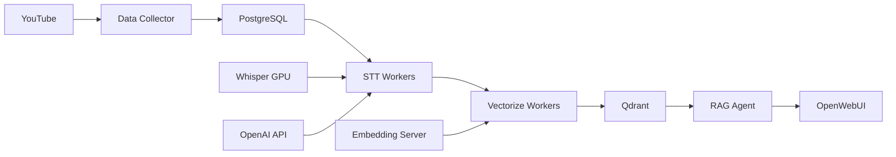

# YouTube Content Agent 🎬🤖

YouTube 콘텐츠를 자동으로 수집, 분석하여 지능형 질의응답을 제공하는 RAG(Retrieval-Augmented Generation) 기반 AI 플랫폼

## ✨ 주요 기능

- 🎙️ **고품질 STT 처리**: Whisper Large-v3 GPU 서버 + OpenAI API 폴백
- 📊 **지능형 벡터화**: BGE-M3 임베딩 (1024차원) + 의미 기반 청킹
- 🔍 **정확한 검색**: LangGraph 기반 RAG 에이전트 + YouTube 타임스탬프 링크
- 💬 **편리한 인터페이스**: OpenWebUI 채팅 + Swagger API 문서
- 💰 **비용 관리**: STT API 사용량 추적 및 한도 설정
- 📈 **모니터링**: 실시간 처리 상태 및 시스템 통계

## 🚀 빠른 시작

### 필수 요구사항
- Docker & Docker Compose
- NVIDIA GPU (선택사항, STT 성능 향상)
- OpenAI API Key

### 설치 및 실행

1. **환경 설정**
```bash
cp .env.example .env
# .env 파일에서 OPENAI_API_KEY 설정
```

2. **서비스 시작**
```bash
docker-compose up -d
```

3. **접속 URL**
- 채팅 인터페이스: http://localhost:3000
- API 문서: http://localhost:8000/docs
- 관리 대시보드: http://localhost:8090
- 모니터링: http://localhost:8081

## 🏗️ 시스템 아키텍처



### 핵심 컴포넌트

| 서비스 | 포트 | 설명 |
|--------|------|------|
| OpenWebUI | 3000 | 채팅 인터페이스 |
| RAG Agent | 8000 | 질의응답 API + Swagger UI |
| Admin Dashboard | 8090 | 채널 및 시스템 관리 |
| Monitoring | 8081 | 처리 상태 모니터링 |
| Whisper Server | 8082 | GPU 기반 STT 서버 |
| Embedding Server | 8083 | BGE-M3 임베딩 서버 |
| STT Cost API | 8084 | 비용 관리 및 승인 |
| Qdrant | 6333 | 벡터 데이터베이스 |
| PostgreSQL | 5432 | 메타데이터 저장소 |
| Redis | 6379 | 캐시 및 작업 큐 |

## 📝 사용법

### 채널 추가
```python
# Admin Dashboard (http://localhost:8090) 또는 API 사용
POST /api/channels
{
  "url": "https://www.youtube.com/@channelname",
  "name": "Channel Name"
}
```

### 질문하기
```bash
# OpenWebUI (http://localhost:3000) 또는 API 사용
curl -X POST http://localhost:8000/ask \
  -H "Content-Type: application/json" \
  -d '{"query": "코스피 전망에 대해 알려줘"}'
```

### OpenAI 호환 API
```python
from openai import OpenAI

client = OpenAI(
    base_url="http://localhost:8000/v1",
    api_key="dummy-key"
)

response = client.chat.completions.create(
    model="youtube-agent",
    messages=[{"role": "user", "content": "질문내용"}]
)
```

## 📊 데이터 처리 파이프라인

1. **수집**: YouTube 채널 → 비디오 메타데이터 → 오디오 다운로드
2. **STT**: Whisper GPU (우선) → OpenAI API (폴백) → 텍스트 + 타임스탬프
3. **정제**: 반복 텍스트 제거 → 할루시네이션 방지 → 오염 텍스트 제거
4. **벡터화**: 문장 청킹 (300-800자) → Summary 생성 → BGE-M3 임베딩
5. **저장**: Qdrant 벡터 DB (summaries + content 컬렉션)
6. **검색**: 의미 기반 검색 → 점수 필터링 (0.55) → 컨텍스트 생성
7. **응답**: LangGraph RAG → YouTube 타임스탬프 링크 포함

## 🔧 설정

### 환경 변수 (.env)
```bash
# 필수
OPENAI_API_KEY=sk-...

# STT 비용 관리 (선택)
STT_DAILY_COST_LIMIT=10.0      # 일일 한도 (USD)
STT_MONTHLY_COST_LIMIT=100.0   # 월별 한도 (USD)
STT_SINGLE_VIDEO_LIMIT=2.0     # 영상당 한도 (USD)
STT_AUTO_APPROVE_THRESHOLD=0.10 # 자동 승인 임계값 (USD)
```

### Docker 컨테이너 (18개)
```bash
# 데이터베이스
- postgres           # 메타데이터 저장
- redis             # 캐시 및 작업 큐
- qdrant            # 벡터 데이터베이스

# 처리 서버
- whisper-server    # Whisper Large-v3 GPU
- embedding-server  # BGE-M3 임베딩
- stt-cost-api     # 비용 관리

# 워커
- data-collector    # YouTube 수집
- data-processor   # 오케스트레이터
- stt-worker-1~3   # STT 처리
- vectorize-worker-1~3 # 벡터화

# 서비스
- agent-service    # RAG 에이전트
- admin-dashboard  # 관리 UI
- monitoring-dashboard # 모니터링
- ui-service      # OpenWebUI
```

## 📈 모니터링 및 관리

### 시스템 상태 확인
```bash
# 서비스 상태
docker-compose ps

# 처리 대기열
curl http://localhost:8081/api/queue

# 비용 현황
curl http://localhost:8084/api/cost-summary

# 벡터 DB 상태
curl http://localhost:6333/collections
```

### 데이터 정리
```bash
# 오염 텍스트 제거
docker exec youtube_data_processor python /app/scripts/clean_initial_prompt.py

# 작업 상태 확인
docker exec youtube_data_processor python -c "
from shared.models.database import ProcessingJob
# ... 작업 상태 조회
"
```

## 🐛 문제 해결

### 일반적인 문제

1. **OpenWebUI 응답 없음**
   - 해결: 타임아웃이 120초로 설정되어 있으므로 대기
   - LLM 응답 생성에 10-15초 소요 정상

2. **STT 처리 실패**
   - GPU 서버 상태 확인: `curl http://localhost:8082/health`
   - OpenAI API 키 확인: `.env` 파일
   - 비용 한도 확인: http://localhost:8084

3. **검색 결과 부정확**
   - RAG 점수 임계값 조정 (현재 0.55)
   - 벡터화 재처리 필요시 강제 재실행

### 로그 확인
```bash
# 특정 서비스 로그
docker-compose logs -f agent-service

# STT 워커 로그
docker-compose logs -f stt-worker-1

# 전체 로그
docker-compose logs --tail=100
```

## 🎯 현재 시스템 상태

### 데이터 현황 (2025-09-22 기준)
- **수집 완료**: 10개 YouTube 채널
- **처리된 트랜스크립트**: 36,208개
- **벡터 DB**:
  - youtube_content: 7,448 포인트 (활성)
  - youtube_summaries: 10 포인트 (활성)
  - youtube_paragraphs: 5,729 포인트 (레거시)
  - youtube_full_texts: 10 포인트 (레거시)

### 데이터 품질
- ✅ 모든 "한국어 팟캐스트" 오염 텍스트 제거 완료
- ✅ Whisper initial_prompt 제거로 향후 오염 방지
- ✅ 반복 텍스트 및 할루시네이션 제거 로직 적용

### 성능 지표
- STT 처리: 실시간 대비 0.3-0.5x
- 검색 응답: 300-500ms
- RAG 응답: 10-15초 (OpenAI GPT-4o 사용)
- 벡터 검색 정확도: 점수 임계값 0.55

## 📚 추가 문서

- [CLAUDE.md](CLAUDE.md) - AI 개발자를 위한 상세 가이드
- [PROJECT_STRUCTURE.md](PROJECT_STRUCTURE.md) - 프로젝트 구조 및 파일 매핑
- [BACKUP_FILES.md](BACKUP_FILES.md) - 백업 파일 관리

## 🛠️ 개발 명령어

### 빌드 및 배포
```bash
# 전체 재빌드
docker-compose down
docker-compose build --no-cache
docker-compose up -d

# 특정 서비스만 재시작
docker-compose restart agent-service

# 안전한 정지 (작업 완료 대기)
docker-compose stop data-processor
# ... 모든 작업 완료 확인 후
docker-compose down
```

### 데이터베이스 작업
```bash
# PostgreSQL 접속
docker exec -it youtube_postgres psql -U youtube_user -d youtube_agent

# 백업
docker exec youtube_postgres pg_dump -U youtube_user youtube_agent > backup.sql

# 복원
docker exec -i youtube_postgres psql -U youtube_user youtube_agent < backup.sql
```

## 🤝 기여하기

이슈 제보 및 PR은 언제나 환영합니다!

1. Fork the repository
2. Create your feature branch (`git checkout -b feature/AmazingFeature`)
3. Commit your changes (`git commit -m 'Add some AmazingFeature'`)
4. Push to the branch (`git push origin feature/AmazingFeature`)
5. Open a Pull Request

## 📄 라이선스

MIT License - 자세한 내용은 [LICENSE](LICENSE) 파일 참조

## 🙏 감사의 글

- OpenAI Whisper 팀
- LangChain/LangGraph 커뮤니티
- Qdrant 벡터 DB 팀
- OpenWebUI 프로젝트

---

**문의사항**: 이슈 탭을 이용해주세요
**최종 업데이트**: 2025-09-22