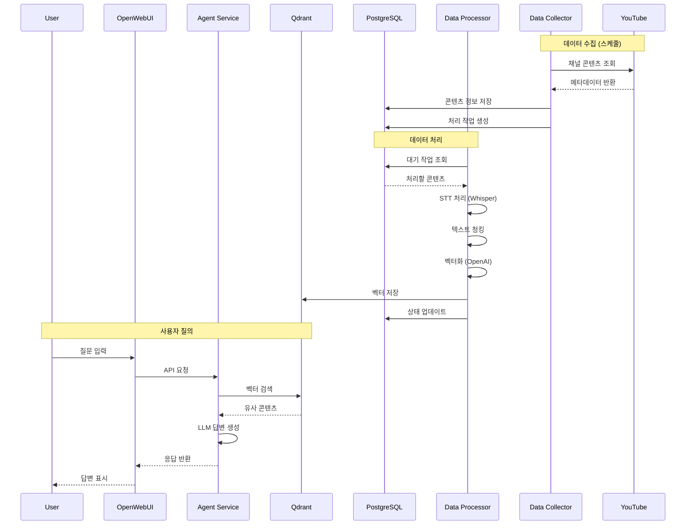

# 아키텍처 개요

## 시스템 아키텍처

YouTube Content Agent는 마이크로서비스 아키텍처로 설계되어 각 서비스가 독립적으로 확장 가능하고 유지보수가 용이합니다.

## 핵심 컴포넌트

### 1. 데이터 수집 계층 (Data Collection Layer)

#### Data Collector Service
- **책임**: YouTube 채널 모니터링 및 콘텐츠 메타데이터 수집
- **기술 스택**: Python, yt-dlp, youtube-transcript-api
- **주요 기능**:
  - YouTube 채널 자동 크롤링
  - 신규 콘텐츠 감지
  - 메타데이터 추출 (제목, 설명, 태그, 길이 등)
  - 자막 다운로드 (가능한 경우)

### 2. 데이터 처리 계층 (Data Processing Layer)

#### Data Processor Service
- **책임**: 오디오 처리, STT 변환, 텍스트 벡터화
- **기술 스택**: Python, Whisper, OpenAI Embeddings
- **주요 기능**:
  - Whisper Large 모델을 통한 STT 처리
  - 반복 텍스트 및 할루시네이션 제거
  - 문장 기반 의미 청킹
  - OpenAI Embeddings를 통한 벡터화

### 3. 저장 계층 (Storage Layer)

#### PostgreSQL
- **용도**: 구조화된 메타데이터 저장
- **저장 데이터**:
  - 채널 정보
  - 콘텐츠 메타데이터
  - 처리 작업 큐
  - 사용자 세션

#### Qdrant Vector Database
- **용도**: 벡터 임베딩 저장 및 유사도 검색
- **저장 데이터**:
  - 텍스트 청크 벡터
  - 메타데이터 (원본 URL, 타임스탬프)
  - 콘텐츠 ID 매핑

#### Redis
- **용도**: 캐싱 및 작업 큐
- **저장 데이터**:
  - 임시 작업 큐
  - 검색 결과 캐시
  - 세션 데이터

### 4. 서비스 계층 (Service Layer)

#### Agent Service
- **책임**: RAG 기반 질의응답 처리
- **기술 스택**: FastAPI, LangGraph, OpenAI GPT
- **주요 기능**:
  - 벡터 유사도 기반 검색
  - LangGraph 워크플로우 실행
  - OpenAI 호환 API 제공

### 5. 프레젠테이션 계층 (Presentation Layer)

#### OpenWebUI
- **책임**: 사용자 인터페이스 제공
- **기술 스택**: SvelteKit, TailwindCSS
- **주요 기능**:
  - 채팅 인터페이스
  - 대화 히스토리 관리
  - 모델 설정 관리

## 데이터 흐름

## 핵심 설계 원칙

### 1. 마이크로서비스 아키텍처
- 각 서비스는 독립적으로 배포 가능
- 서비스 간 느슨한 결합
- API를 통한 통신

### 2. 확장성
- 수평적 확장 가능한 설계
- 작업 큐를 통한 비동기 처리
- 캐싱을 통한 성능 최적화

### 3. 신뢰성
- 재시도 메커니즘
- 상태 모니터링
- 자동 복구 기능

### 4. 유지보수성
- 모듈화된 코드 구조
- 명확한 책임 분리
- 포괄적인 로깅

## 기술 스택 상세

### 백엔드
- **언어**: Python 3.11+
- **웹 프레임워크**: FastAPI
- **작업 큐**: Redis + Custom Worker
- **ORM**: SQLAlchemy

### AI/ML
- **STT**: OpenAI Whisper (Large 모델)
- **임베딩**: OpenAI text-embedding-3-small
- **LLM**: OpenAI GPT-4
- **오케스트레이션**: LangGraph

### 데이터베이스
- **관계형 DB**: PostgreSQL 15
- **벡터 DB**: Qdrant 1.7+
- **캐시**: Redis 7+

### 인프라
- **컨테이너화**: Docker
- **오케스트레이션**: Docker Compose
- **리버스 프록시**: Nginx (OpenWebUI 내장)

## 보안 고려사항

### API 보안
- API 키 인증
- Rate limiting
- CORS 설정

### 데이터 보안
- 환경 변수를 통한 시크릿 관리
- 데이터베이스 연결 암호화
- 민감 정보 로깅 방지

### 네트워크 보안
- 내부 네트워크 격리
- 최소 권한 원칙
- 방화벽 규칙

## 성능 최적화

### 캐싱 전략
- Redis를 통한 검색 결과 캐싱
- 모델 사전 로딩
- 정적 자산 캐싱

### 배치 처리
- 벡터화 배치 처리
- 데이터베이스 벌크 삽입
- 병렬 처리 활용

### 리소스 관리
- 컨테이너 리소스 제한
- 메모리 효율적인 데이터 처리
- GPU 활용 (가능한 경우)

## 모니터링 포인트

### 시스템 메트릭
- CPU/메모리 사용률
- 디스크 I/O
- 네트워크 트래픽

### 애플리케이션 메트릭
- API 응답 시간
- 처리 작업 큐 크기
- 에러 발생률

### 비즈니스 메트릭
- 일일 처리 콘텐츠 수
- 평균 응답 생성 시간
- 사용자 만족도 지표