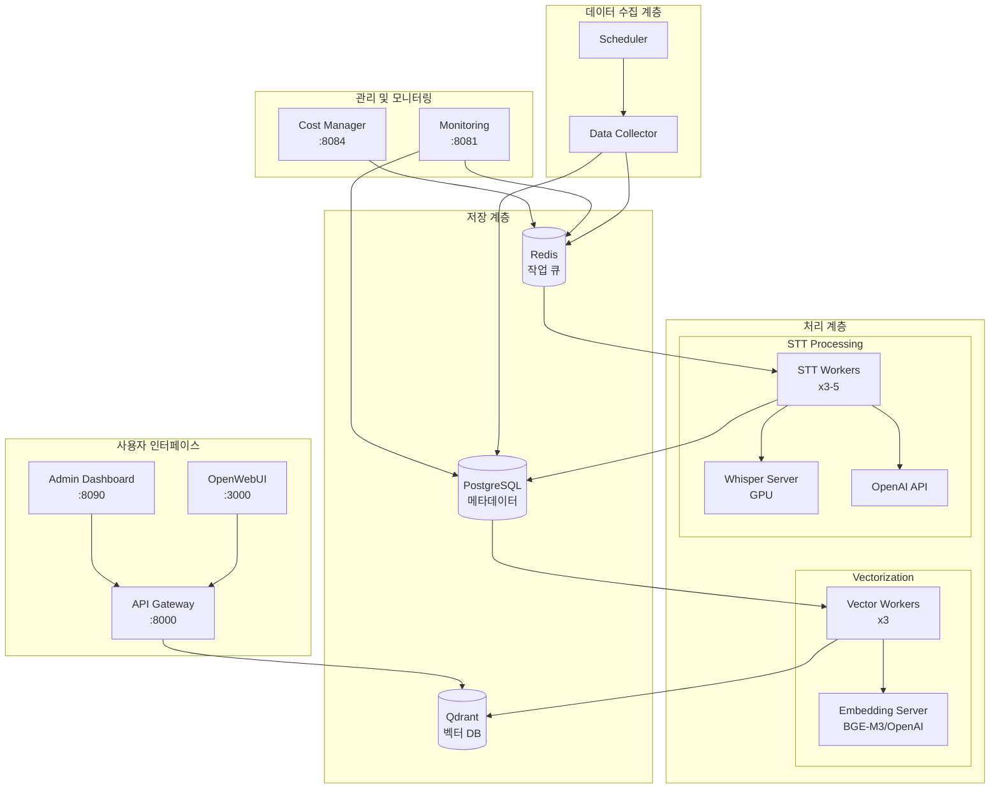

# YouTube Agent 시스템 아키텍처 🏗️

## 📋 목차
1. [시스템 개요](#시스템-개요)
2. [아키텍처 다이어그램](#아키텍처-다이어그램)
3. [핵심 컴포넌트](#핵심-컴포넌트)
4. [데이터 플로우](#데이터-플로우)
5. [기술 스택](#기술-스택)
6. [확장성 및 성능](#확장성-및-성능)
7. [보안 및 규정 준수](#보안-및-규정-준수)

---

## 시스템 개요

YouTube Agent는 마이크로서비스 아키텍처로 설계된 분산 시스템으로, 다음과 같은 특징을 가집니다:

- **모듈화**: 각 기능이 독립적인 서비스로 분리
- **확장성**: 수평적 확장 가능한 워커 풀 구조
- **유연성**: GPU/CPU 모드 자동 전환
- **신뢰성**: 장애 격리 및 자동 복구

---

## 아키텍처 다이어그램



---

## 핵심 컴포넌트

### 1. 데이터 수집 서비스 (Data Collector)
- **역할**: YouTube 채널 모니터링 및 콘텐츠 수집
- **기술**: Python, yt-dlp, BeautifulSoup
- **특징**:
  - 4시간마다 자동 수집
  - 증분 업데이트 지원
  - Soft Delete 콘텐츠 스킵

### 2. STT 처리 서비스
- **GPU 모드**: Whisper Large-v3 (자체 호스팅)
  - VRAM 8GB+ 요구
  - 실시간 대비 0.3x 처리 속도
  - 높은 정확도 (95%+)

- **CPU 모드**: OpenAI Whisper API
  - 비용 기반 제한 ($10/일 기본값)
  - 자동 승인/거부 시스템
  - 병렬 처리 (5 워커)

### 3. 벡터화 서비스
- **임베딩 모델**:
  - GPU: BGE-M3 (1024차원)
  - CPU: OpenAI text-embedding-3-small

- **청킹 전략**:
  - 문장 기반 의미 청킹
  - 300-800자 단위
  - 타임스탬프 보존

### 4. RAG 에이전트
- **프레임워크**: LangGraph
- **검색 전략**:
  - 다층 벡터 검색 (summaries + chunks)
  - 하이브리드 스코어링
  - 타임스탬프 링크 생성

- **LLM**: GPT-4 Turbo
- **응답 시간**: <3초

### 5. 관리 대시보드
- **채널 관리**:
  - CRUD 작업
  - 활성/비활성 토글
  - 일괄 작업

- **콘텐츠 관리**:
  - Soft Delete
  - 개별/일괄 제어
  - 정렬 및 필터링
  - Vector DB 동기화

### 6. 모니터링 시스템
- **실시간 지표**:
  - 처리 큐 상태
  - 워커 활동
  - 에러율

- **알림**:
  - 처리 실패
  - 비용 한도 초과
  - 시스템 리소스 경고

---

## 데이터 플로우

### 1. 수집 플로우
```
YouTube API → Data Collector → Content 테이블 → Processing Job 큐
```

### 2. STT 처리 플로우
```
Processing Job → STT Worker → Audio 다운로드 → Whisper/OpenAI
→ Transcript 테이블 → Vectorize Job 큐
```

### 3. 벡터화 플로우
```
Vectorize Job → Vector Worker → 청킹 → 임베딩 생성
→ Qdrant 저장 → Vector Mapping 테이블
```

### 4. 검색 플로우
```
사용자 쿼리 → RAG Agent → 임베딩 생성 → Qdrant 검색
→ 컨텍스트 구성 → LLM 생성 → 타임스탬프 링크 포함 응답
```

---

## 기술 스택

### Backend
- **언어**: Python 3.11
- **프레임워크**: FastAPI, LangChain, LangGraph
- **작업 큐**: Redis + Custom Queue
- **ORM**: SQLAlchemy

### Database
- **관계형 DB**: PostgreSQL 15
  - 채널, 콘텐츠, 트랜스크립트
  - 처리 작업, 매핑 정보

- **벡터 DB**: Qdrant 1.7
  - youtube_content (청크)
  - youtube_summaries (요약)
  - 1024차원 벡터

- **캐시/큐**: Redis 7
  - 작업 큐
  - 비용 승인 대기열
  - 임시 캐시

### Infrastructure
- **컨테이너**: Docker, Docker Compose
- **네트워크**: Bridge Network (youtube_network)
- **볼륨**: Named Volumes (데이터 영속성)
- **GPU**: NVIDIA Docker (선택적)

### Frontend
- **템플릿**: Jinja2
- **CSS**: Bootstrap 5
- **JS**: Vanilla JavaScript
- **아이콘**: Font Awesome

---

## 확장성 및 성능

### 현재 성능
- **처리 용량**: 50개 영상/일
- **STT 속도**: 실시간 대비 0.3-0.5x
- **검색 응답**: <500ms
- **RAG 응답**: <3초

### 확장 전략
1. **수평 확장**:
   - 워커 수 증가 (3→10)
   - 다중 GPU 노드
   - 로드 밸런싱

2. **수직 확장**:
   - GPU 업그레이드 (A100)
   - 메모리 증설
   - NVMe SSD

3. **최적화**:
   - 벡터 인덱스 최적화 (HNSW)
   - 쿼리 캐싱
   - 배치 처리

### 병목 지점 및 해결 방안
- **STT 처리**: GPU 추가 또는 API 병렬화
- **벡터 검색**: 인덱스 파티셔닝
- **DB 쿼리**: 인덱스 최적화, Read Replica

---

## 보안 및 규정 준수

### 보안 조치
1. **API 보안**:
   - API 키 관리 (환경변수)
   - Rate Limiting
   - CORS 설정

2. **데이터 보호**:
   - PostgreSQL 암호화
   - Redis 인증
   - HTTPS (프로덕션)

3. **접근 제어**:
   - 서비스별 격리
   - 네트워크 세그멘테이션
   - 최소 권한 원칙

### 규정 준수
- **저작권**: YouTube ToS 준수
- **개인정보**: GDPR 고려사항
- **데이터 보관**: 보관 정책 수립

---

## 모니터링 및 로깅

### 메트릭 수집
```python
# 주요 모니터링 지표
- 처리 큐 길이
- 워커 활용률
- 에러율
- API 응답 시간
- 비용 사용량
```

### 로깅 전략
- **레벨**: DEBUG, INFO, WARNING, ERROR
- **저장**: Docker logs + 파일
- **보관**: 30일 로테이션

### 알림 시스템
- 처리 실패 > 10%
- 큐 지연 > 1시간
- 비용 한도 80% 도달
- 시스템 리소스 > 80%

---

## 개발 및 배포

### 개발 환경
```bash
# 로컬 개발
docker-compose -f docker-compose.base.yml up
python -m venv venv
pip install -r requirements.txt
```

### 테스트 전략
- **단위 테스트**: pytest
- **통합 테스트**: Docker Compose
- **E2E 테스트**: Selenium
- **부하 테스트**: Locust

### 배포 프로세스
1. 코드 검토 (PR)
2. 자동화 테스트
3. 스테이징 배포
4. 프로덕션 배포 (Blue-Green)

---

## 장애 대응

### 장애 시나리오
1. **STT 서버 다운**:
   - 자동 OpenAI API 폴백
   - 알림 발송

2. **DB 연결 실패**:
   - 연결 재시도 (exponential backoff)
   - 읽기 전용 모드 전환

3. **비용 한도 초과**:
   - 자동 처리 중단
   - 관리자 승인 대기

### 복구 절차
```bash
# 1. 서비스 상태 확인
docker ps
docker logs [container_name]

# 2. 문제 서비스 재시작
docker restart [container_name]

# 3. 데이터 정합성 확인
python scripts/check_integrity.py

# 4. 실패 작업 재처리
python scripts/retry_failed_jobs.py
```

---

## 향후 아키텍처 개선 방향

### 단기 (1-3개월)
- Kubernetes 마이그레이션
- Prometheus + Grafana 모니터링
- CI/CD 파이프라인 구축

### 중기 (3-6개월)
- 이벤트 드리븐 아키텍처 (Kafka)
- 서비스 메시 (Istio)
- 분산 트레이싱 (Jaeger)

### 장기 (6-12개월)
- 멀티 리전 배포
- 연합 학습 시스템
- Edge 컴퓨팅 지원

---

**마지막 업데이트**: 2025년 9월 23일
**버전**: 1.0.0
**작성자**: YouTube Agent 개발팀