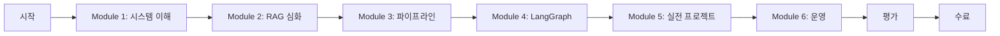

# YouTube Content Agent 교육 가이드

## 🎯 학습 목표

이 교육 가이드를 완료하면 다음을 이해하고 활용할 수 있게 됩니다:

1. RAG (Retrieval-Augmented Generation) 시스템의 원리와 구현
2. 마이크로서비스 아키텍처 설계 및 구현
3. 대규모 콘텐츠 처리 파이프라인 구축
4. AI/ML 모델 통합 및 최적화
5. 프로덕션 레벨 시스템 운영

## 📚 커리큘럼

### Module 1: 시스템 이해 (2시간)

#### 1.1 프로젝트 개요
- YouTube Content Agent란?
- 해결하고자 하는 문제
- 핵심 가치 제안

#### 1.2 아키텍처 이해
- 마이크로서비스 아키텍처 개념
- 각 서비스의 역할과 책임
- 서비스 간 통신 방식

#### 1.3 기술 스택 소개
- Python 생태계
- Docker와 컨테이너화
- AI/ML 도구들 (Whisper, OpenAI, LangChain)

### Module 2: RAG 시스템 심화 (4시간)

#### 2.1 RAG 개념과 원리
```
RAG = Retrieval + Augmented + Generation

1. Retrieval (검색)
   - 벡터 데이터베이스의 역할
   - 임베딩과 유사도 검색
   - Qdrant 활용법

2. Augmented (증강)
   - 컨텍스트 주입
   - 프롬프트 엔지니어링
   - 메타데이터 활용

3. Generation (생성)
   - LLM 활용
   - 응답 생성 전략
   - 할루시네이션 방지
```

#### 2.2 벡터 임베딩 이해
```python
# 임베딩 생성 예제
from openai import OpenAI

client = OpenAI()

def create_embedding(text):
    """텍스트를 벡터로 변환"""
    response = client.embeddings.create(
        model="text-embedding-3-small",
        input=text
    )
    return response.data[0].embedding

# 유사도 계산
def cosine_similarity(vec1, vec2):
    """두 벡터 간 코사인 유사도 계산"""
    import numpy as np
    return np.dot(vec1, vec2) / (np.linalg.norm(vec1) * np.linalg.norm(vec2))
```

#### 2.3 청킹 전략
```python
# 문장 기반 청킹 구현
def sentence_based_chunking(text, min_size=300, max_size=800):
    """문장 단위로 텍스트를 청킹"""
    sentences = text.split('.')
    chunks = []
    current_chunk = ""

    for sentence in sentences:
        if len(current_chunk) + len(sentence) < max_size:
            current_chunk += sentence + "."
        else:
            if len(current_chunk) > min_size:
                chunks.append(current_chunk.strip())
                current_chunk = sentence + "."

    if current_chunk:
        chunks.append(current_chunk.strip())

    return chunks
```

### Module 3: 데이터 파이프라인 구축 (6시간)

#### 3.1 데이터 수집
```python
# YouTube 데이터 수집 워크플로우
class YouTubeCollector:
    def collect_channel(self, channel_url):
        """채널의 모든 비디오 수집"""
        # 1. 채널 정보 파싱
        channel_info = self.parse_channel(channel_url)

        # 2. 비디오 목록 수집
        videos = self.get_video_list(channel_info)

        # 3. 메타데이터 저장
        for video in videos:
            self.save_metadata(video)
            self.create_processing_job(video)
```

#### 3.2 STT 처리
```python
# Whisper STT 구현
import whisper

class WhisperProcessor:
    def __init__(self, model_size="large"):
        self.model = whisper.load_model(model_size)

    def transcribe(self, audio_path):
        """오디오를 텍스트로 변환"""
        result = self.model.transcribe(
            audio_path,
            language='ko',
            beam_size=1,  # 할루시네이션 방지
            temperature=0.0
        )
        return self.clean_text(result['text'])

    def clean_text(self, text):
        """반복 텍스트 제거"""
        # 구현...
```

#### 3.3 벡터화 프로세스
```python
# 벡터화 파이프라인
class VectorizationPipeline:
    def process(self, content):
        # 1. 텍스트 청킹
        chunks = self.create_chunks(content.transcript)

        # 2. 각 청크 벡터화
        for chunk in chunks:
            vector = self.create_embedding(chunk.text)

            # 3. 메타데이터와 함께 저장
            self.store_vector(
                vector=vector,
                text=chunk.text,
                metadata={
                    'content_id': content.id,
                    'timestamp_url': chunk.timestamp_url,
                    'channel': content.channel
                }
            )
```

### Module 4: LangGraph 워크플로우 (4시간)

#### 4.1 LangGraph 기초
```python
from langgraph.graph import StateGraph, State

class AgentState(State):
    query: str
    search_results: list
    answer: str

# 워크플로우 정의
workflow = StateGraph(AgentState)

# 노드 추가
workflow.add_node("search", search_node)
workflow.add_node("generate", generate_node)
workflow.add_node("refine", refine_node)

# 엣지 연결
workflow.add_edge("search", "generate")
workflow.add_edge("generate", "refine")
```

#### 4.2 검색 노드 구현
```python
async def search_node(state: AgentState):
    """벡터 데이터베이스에서 관련 콘텐츠 검색"""
    # Qdrant 검색
    results = await qdrant_client.search(
        collection_name="youtube_content",
        query_vector=create_embedding(state.query),
        limit=5
    )

    state.search_results = results
    return state
```

#### 4.3 생성 및 개선 노드
```python
async def generate_node(state: AgentState):
    """검색 결과 기반 답변 생성"""
    context = format_context(state.search_results)

    prompt = f"""
    다음 컨텍스트를 기반으로 질문에 답하세요:

    컨텍스트: {context}
    질문: {state.query}
    """

    state.answer = await llm.generate(prompt)
    return state

async def refine_node(state: AgentState):
    """답변 개선 및 출처 추가"""
    # 타임스탬프 링크 추가
    # 답변 검증
    # 형식 개선
    return state
```

### Module 5: 실전 프로젝트 (8시간)

#### 5.1 프로젝트 설정
1. 개발 환경 구성
2. Docker 컨테이너 빌드
3. 서비스 연동 테스트

#### 5.2 실제 채널 처리
1. YouTube 채널 선택
2. 데이터 수집 실행
3. STT 처리 모니터링
4. 벡터화 완료 확인

#### 5.3 사용자 인터페이스
1. OpenWebUI 설정
2. 대화 테스트
3. API 통합

#### 5.4 성능 최적화
1. 배치 처리 조정
2. 캐싱 전략 구현
3. 리소스 모니터링

### Module 6: 운영 및 유지보수 (4시간)

#### 6.1 모니터링
```python
# 헬스체크 구현
@app.get("/health")
async def health_check():
    checks = {
        "database": check_database(),
        "qdrant": check_qdrant(),
        "redis": check_redis()
    }
    return {"status": "healthy", "checks": checks}
```

#### 6.2 로깅 및 디버깅
```python
import logging

# 구조화된 로깅
logger = logging.getLogger(__name__)

def process_content(content_id):
    logger.info("Processing started", extra={
        "content_id": content_id,
        "timestamp": datetime.now()
    })

    try:
        # 처리 로직
        pass
    except Exception as e:
        logger.error("Processing failed", extra={
            "content_id": content_id,
            "error": str(e)
        })
```

#### 6.3 백업 및 복구
```bash
# 자동 백업 스크립트
#!/bin/bash
DATE=$(date +%Y%m%d_%H%M%S)
pg_dump -U youtube_user youtube_agent > backup_$DATE.sql
aws s3 cp backup_$DATE.sql s3://backups/
```

## 🎓 평가 및 인증

### 실습 과제

#### 과제 1: 커스텀 청킹 알고리즘
- 주제 기반 청킹 구현
- 성능 비교 분석
- 문서화

#### 과제 2: 새로운 데이터 소스 추가
- Podcast 플랫폼 통합
- 수집기 구현
- 파이프라인 통합

#### 과제 3: 성능 개선
- 현재 병목 지점 식별
- 개선 방안 구현
- 벤치마크 결과

### 평가 기준
- 코드 품질 (40%)
- 시스템 이해도 (30%)
- 문제 해결 능력 (20%)
- 문서화 (10%)

## 📖 추가 학습 자료

### 필독 자료
1. [RAG 논문](https://arxiv.org/abs/2005.11401) - "Retrieval-Augmented Generation"
2. [Whisper 논문](https://arxiv.org/abs/2212.04356) - "Robust Speech Recognition"
3. [LangChain 문서](https://python.langchain.com/) - 공식 문서

### 추천 도서
- "Designing Data-Intensive Applications" - Martin Kleppmann
- "Building Microservices" - Sam Newman
- "Natural Language Processing with Transformers" - Lewis Tunstall

### 온라인 코스
- Fast.ai - Practical Deep Learning
- Coursera - Natural Language Processing Specialization
- Docker Mastery - Complete Course

## 🏆 수료 기준

### 필수 완료 항목
- [ ] 모든 모듈 학습 완료
- [ ] 실습 과제 3개 제출
- [ ] 최종 프로젝트 완성
- [ ] 코드 리뷰 통과

### 인증서 발급
- 수료 기준 충족 시 "YouTube Content Agent Developer" 인증서 발급
- GitHub 프로필에 추가 가능한 배지 제공

## 💬 Q&A 및 지원

### 학습 지원
- Slack 채널: #youtube-agent-education
- 오피스 아워: 매주 수요일 14:00-16:00
- 1:1 멘토링: 신청제

### FAQ

**Q: 사전 지식이 얼마나 필요한가요?**
A: Python 중급, Docker 기초, SQL 기초 지식이 필요합니다.

**Q: 학습 기간은 얼마나 걸리나요?**
A: 주 10시간 투자 시 약 3-4주 소요됩니다.

**Q: GPU가 꼭 필요한가요?**
A: 필수는 아니지만 Whisper 처리 속도를 위해 권장됩니다.

## 🎯 학습 로드맵



---

**시작할 준비가 되셨나요?**
첫 모듈부터 차근차근 시작해보세요. 질문이 있으시면 언제든지 커뮤니티에 문의해주세요!